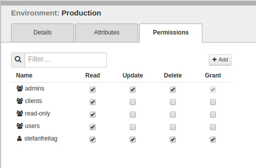

## knife acl plugin


### Installation

- Chef Development Kit already setup  
- Install knife-acl gem on local machine 

```bash
$ chef gem install knife-acl

Fetching: knife-acl-1.0.3.gem (100%)
WARNING:  You don't have /home/stefan/.chefdk/gem/ruby/2.5.0/bin in your PATH,
         gem executables will not run.
Successfully installed knife-acl-1.0.3
1 gem installed
```


### Usage

ACLs can be
- added, 
- removed, and
- shown

knife syntax
```bash
knife acl add MEMBER_TYPE MEMBER_NAME OBJECT_TYPE OBJECT_NAME PERMS
knife acl bulk add MEMBER_TYPE MEMBER_NAME OBJECT_TYPE REGEX PERMS

knife acl remove MEMBER_TYPE MEMBER_NAME OBJECT_TYPE OBJECT_NAME PERMS
knife acl bulk remove MEMBER_TYPE MEMBER_NAME OBJECT_TYPE REGEX PERMS

knife acl show OBJECT_TYPE OBJECT_NAME
```


#### Show details for an environment

```bash
$ knife environment show Playground
chef_type:           environment
cookbook_versions:
default_attributes:
description:         If it brakes - do not worry.
json_class:          Chef::Environment
name:                Playground
override_attributes:
```


#### Show ACLs for an environment

```bash
$ knife acl show environments Playground
create:
  clients:
  groups:
    admins
    users
  users:
    pivotal
    stefanfreitag
delete:
  clients:
  groups:
    admins
    users
  users:
    pivotal
    stefanfreitag
grant:
  clients:
  groups:  admins
  users:
    pivotal
    stefanfreitag
read:
  clients:
  groups:
    admins
    clients
    users
  users:
    pivotal
    stefanfreitag
update:
  clients:
  groups:
    admins
    users
  users:
    pivotal
    stefanfreitag
```


####  Review the permissions

__Members of `users` can delete the environment!__

```bash
delete:
  clients:
  groups:
    admins
    users
  users:
    pivotal
    stefanfreitag
```


#### Removal of ACLs

```bash
$ knife acl bulk remove group users environments '.*' create,update,delete,grant
 
The ACL of the following environments will be modified:
 
Playground
 
Are you sure you want to modify the ACL of these environments?? (Y/N) Y
Removing 'users' from 'create' ACE of 'Playground'
Removing 'users' from 'update' ACE of 'Playground'
Removing 'users' from 'delete' ACE of 'Playground'
Removing 'users' from 'grant' ACE of 'Playground'
```


#### Managing ACLs with Chef Manage




## Links

- https://docs.chef.io/auth.html
- https://manage.chef.io